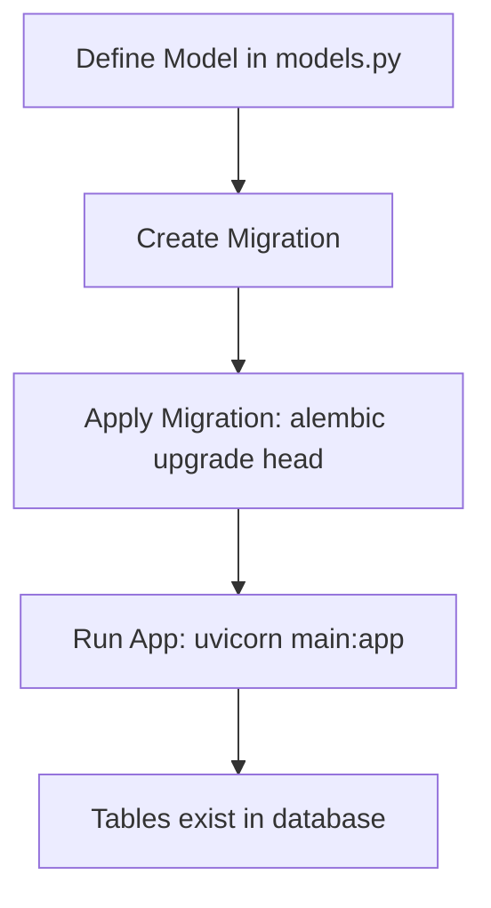
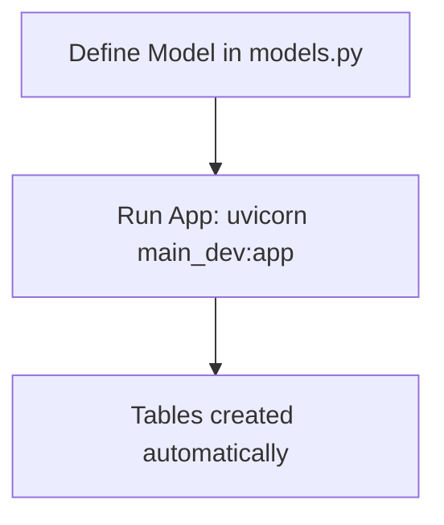

# Student Management System API

A FastAPI-based REST API for managing student classes with proper project structure following FastAPI best practices.

## ⚡ Quick Start

```bash
# 1. Clone and setup
git clone <repository-url>
cd student
python3 -m venv .venv
source .venv/bin/activate
pip install -r requirements.txt

# 2. Configure environment
cp .env.example .env  # Edit with your database settings

# 3. Run (choose one method)

# Development (auto-creates tables)
uvicorn main_dev:app --reload

# Production (uses migrations)
alembic upgrade head
uvicorn main:app --reload

# 4. Access API
# http://localhost:8000/docs
```

## 🚀 Features

- **Classroom Management**: Create, read, update, and delete classrooms
- **RESTful API**: Follows REST conventions with proper HTTP status codes
- **Data Validation**: Pydantic schemas for request/response validation
- **Database Integration**: PostgreSQL with SQLAlchemy ORM
- **Auto Documentation**: Interactive API docs with Swagger UI
- **Error Handling**: Comprehensive error handling with proper HTTP exceptions
- **Project Structure**: Organized code following FastAPI best practices

## 📁 Project Structure

```
student/
├── config.py          # Centralized configuration management
├── database.py        # Database connection and session management
├── main.py           # FastAPI application (production mode)
├── main_dev.py       # FastAPI application (development mode)
├── models.py         # SQLAlchemy database models
├── schemas.py        # Pydantic schemas for data validation
├── routers/          # API route organization
│   ├── __init__.py
│   └── classrooms.py # Classroom-related API endpoints
├── alembic/          # Database migration files
│   ├── env.py        # Alembic environment configuration
│   └── versions/     # Migration version files
├── alembic.ini       # Alembic configuration
├── requirements.txt  # Python dependencies
└── README.md        # Project documentation
```

### **File Descriptions**

| File | Purpose | Key Features |
|------|---------|--------------|
| `config.py` | Configuration management | Environment variables, database settings |
| `database.py` | Database connection | SQLAlchemy engine, session management |
| `main.py` | Production app | Uses Alembic migrations |
| `main_dev.py` | Development app | Auto-creates tables |
| `models.py` | Database models | SQLAlchemy ORM models |
| `schemas.py` | Data validation | Pydantic request/response schemas |
| `routers/classrooms.py` | API endpoints | CRUD operations for classrooms |
| `alembic/` | Database migrations | Version-controlled schema changes |

## 🛠️ Installation

### Prerequisites
- Python 3.8+
- PostgreSQL database

### Setup

1. **Clone the repository**
   ```bash
   git clone <repository-url>
   cd student
   ```

2. **Create virtual environment**
   ```bash
   python -m venv venv
   source venv/bin/activate  # On Windows: venv\Scripts\activate
   ```

3. **Install dependencies**
   ```bash
   pip install -r requirements.txt
   ```

4. **Environment Configuration**
   Create a `.env` file in the root directory:
   ```env
   DB_HOST=localhost
   DB_PORT=5432
   DB_NAME=student_db
   DB_USER=postgres
   DB_PASSWORD=your_password
   ```

5. **Database Setup**
   - Create a PostgreSQL database named `student_db`
   - The application will automatically create tables on first run

## 🏃‍♂️ Running the Application

### Development Mode (Automatic Table Creation)
```bash
# For quick development - tables created automatically
uvicorn main_dev:app --reload
```

### Production Mode (Alembic Migrations)
```bash
# First, apply database migrations
alembic upgrade head

# Then run the application
uvicorn main:app --host 0.0.0.0 --port 8000
```

The API will be available at:
- **API Base URL**: `http://localhost:8000`
- **Interactive Docs**: `http://localhost:8000/docs`
- **ReDoc Documentation**: `http://localhost:8000/redoc`

## 📚 API Endpoints

### Classroom Management

| Method | Endpoint | Description |
|--------|----------|-------------|
| `GET` | `/api/v1/classrooms/` | Get all classrooms (with pagination) |
| `GET` | `/api/v1/classrooms/{id}` | Get specific classroom by ID |
| `POST` | `/api/v1/classrooms/` | Create a new classroom |
| `PUT` | `/api/v1/classrooms/{id}` | Update a classroom |
| `DELETE` | `/api/v1/classrooms/{id}` | Delete a classroom |

### Health Check
| Method | Endpoint | Description |
|--------|----------|-------------|
| `GET` | `/health` | Check API and database connectivity |

## 📝 API Usage Examples

### Create a Classroom
```bash
curl -X POST "http://localhost:8000/api/v1/classrooms/" \
     -H "Content-Type: application/json" \
     -d '{
       "class_name": "Mathematics 101",
       "class_teacher": "Dr. Smith"
     }'
```

### Get All Classrooms
```bash
curl -X GET "http://localhost:8000/api/v1/classrooms/"
```

### Get Specific Classroom
```bash
curl -X GET "http://localhost:8000/api/v1/classrooms/1"
```

### Update a Classroom
```bash
curl -X PUT "http://localhost:8000/api/v1/classrooms/1" \
     -H "Content-Type: application/json" \
     -d '{
       "class_name": "Advanced Mathematics 101",
       "class_teacher": "Dr. Johnson"
     }'
```

### Delete a Classroom
```bash
curl -X DELETE "http://localhost:8000/api/v1/classrooms/1"
```

## 🗄️ Database Schema

### Classrooms Table
| Column | Type | Constraints | Description |
|--------|------|-------------|-------------|
| `id` | Integer | Primary Key, Auto-increment | Unique classroom identifier |
| `class_name` | String | Not Null, Indexed | Name of the classroom |
| `class_teacher` | String | Not Null | Teacher assigned to the classroom |

## 🔄 Database Setup & Model Flow

### **How Models Reflect to Database**

The project supports two approaches for database table creation:

#### **🚀 Production Flow (Recommended)**


**Steps:**
1. **Define Model** in `models.py`
2. **Create Migration**: `alembic revision --autogenerate -m "message"`
3. **Apply Migration**: `alembic upgrade head`
4. **Run App**: `uvicorn main:app --reload`

#### **⚡ Development Flow (Quick Testing)**


**Steps:**
1. **Define Model** in `models.py`
2. **Run App**: `uvicorn main_dev:app --reload` (auto-creates tables)

### **Database Commands Reference**

| Purpose | Command | What it does |
|---------|---------|--------------|
| **Development** | `uvicorn main_dev:app --reload` | Auto-creates tables |
| **Production** | `alembic upgrade head` | Applies migrations |
| **Production** | `uvicorn main:app --reload` | Runs app (tables already exist) |
| **New Migration** | `alembic revision --autogenerate -m "message"` | Creates migration file |
| **Check Status** | `alembic current` | Shows current migration |
| **Rollback** | `alembic downgrade -1` | Rollback last migration |

### **Migration Management**

#### **Creating New Migrations**
```bash
# After modifying models.py, create a new migration
alembic revision --autogenerate -m "Add new field to classroom"

# Apply the migration
alembic upgrade head
```

#### **Migration History**
```bash
# View migration history
alembic history

# Check current migration
alembic current
```

#### **Rollback Migrations**
```bash
# Rollback one migration
alembic downgrade -1

# Rollback to specific migration
alembic downgrade <revision_id>
```

## 🔧 Configuration

The application uses a centralized configuration system in `config.py`:

- **Database Settings**: Connection parameters from environment variables
- **API Settings**: API versioning and project metadata
- **Environment Variables**: Secure configuration management

## 🧪 Testing

### Health Check
```bash
curl -X GET "http://localhost:8000/health"
```

Expected response:
```json
{
  "status": "healthy",
  "database": "connected",
  "message": "Database connection successful"
}
```

## 📋 Request/Response Schemas

### Classroom Creation Schema
```json
{
  "class_name": "string",
  "class_teacher": "string"
}
```

### Classroom Response Schema
```json
{
  "id": 1,
  "class_name": "string",
  "class_teacher": "string"
}
```

## 🚨 Error Handling

The API returns appropriate HTTP status codes:

- `200 OK`: Successful GET/PUT requests
- `201 Created`: Successful POST requests
- `204 No Content`: Successful DELETE requests
- `400 Bad Request`: Invalid request data
- `404 Not Found`: Resource not found
- `422 Unprocessable Entity`: Validation errors

## 🛡️ Best Practices Implemented

- **Separation of Concerns**: Models, schemas, and routes are properly separated
- **Dependency Injection**: Database sessions are properly managed
- **Data Validation**: Pydantic schemas ensure data integrity
- **Error Handling**: Comprehensive error responses
- **API Documentation**: Auto-generated interactive documentation
- **Configuration Management**: Environment-based configuration
- **Database Best Practices**: Proper ORM usage with SQLAlchemy

## 🔄 Development Workflow

### **Adding New Models**

1. **Define Model** in `models.py`
2. **Create Migration** (production):
   ```bash
   alembic revision --autogenerate -m "Add new model"
   alembic upgrade head
   ```
3. **Create Schemas** in `schemas.py` for validation
4. **Implement Routes** in `routers/` directory
5. **Update main.py** to include new routers
6. **Test Endpoints** using the interactive docs at `/docs`

### **Model Development Best Practices**

#### **✅ DO:**
- Use descriptive model names (avoid Python keywords like `class`)
- Add proper constraints and indexes
- Use nullable=False for required fields
- Create migrations for production changes

#### **❌ DON'T:**
- Mix automatic table creation with migrations
- Use reserved Python keywords as model names
- Skip validation schemas
- Forget to test database changes

## 🚨 Troubleshooting

### **Common Issues**

#### **Database Connection Errors**
```bash
# Check if PostgreSQL is running
brew services list | grep postgresql

# Start PostgreSQL
brew services start postgresql
```

#### **Migration Conflicts**
```bash
# Check current migration status
alembic current

# View migration history
alembic history

# Resolve conflicts by editing migration files
```

#### **Table Already Exists Error**
```bash
# If using both methods, choose one:
# Option 1: Use main_dev.py (automatic creation)
uvicorn main_dev:app --reload

# Option 2: Use main.py with migrations
alembic upgrade head
uvicorn main:app --reload
```

#### **Virtual Environment Issues**
```bash
# Create and activate virtual environment
python3 -m venv .venv
source .venv/bin/activate

# Install dependencies
pip install -r requirements.txt
```

## 📦 Dependencies

- **FastAPI**: Modern, fast web framework for building APIs
- **SQLAlchemy**: SQL toolkit and ORM
- **Pydantic**: Data validation using Python type annotations
- **PostgreSQL**: Relational database
- **Uvicorn**: ASGI server for running FastAPI applications

## 🤝 Contributing

1. Fork the repository
2. Create a feature branch
3. Make your changes
4. Add tests if applicable
5. Submit a pull request

## 📄 License

This project is licensed under the MIT License.